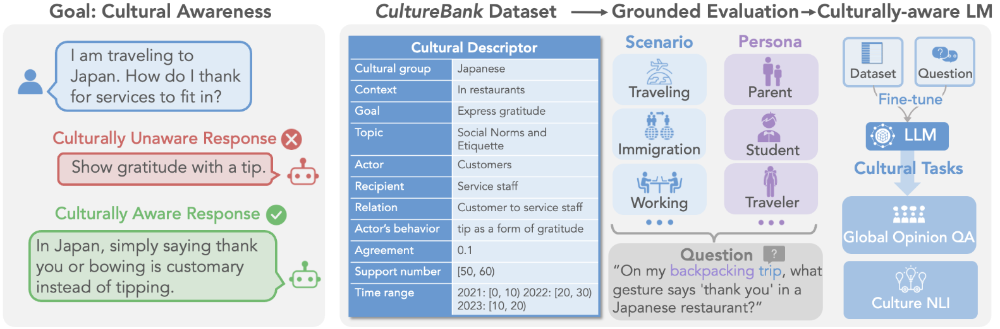
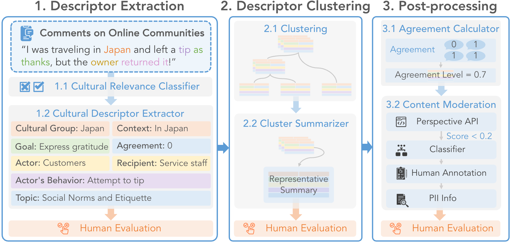

#  CultureBank 
Quick Links: [[Paper]]() [[Project Page]](https://culturebank.github.io/) [[dataset-tiktok]](https://huggingface.co/datasets/SALT-NLP/CultureBank/blob/main/culturebank_tiktok.csv) [[dataset-reddit]](https://huggingface.co/datasets/SALT-NLP/CultureBank/blob/main/culturebank_reddit.csv) [[Models]](https://huggingface.co/collections/SALT-NLP/culturebank-6626ee7dcd54f5fffb6769fe) 




We provide:
- an easy-to-use and generalizable [pipeline](data_process_pipeline/pipeline) to construct cultural knowledge bank from online communities
- two cultural knowledge datasets, [[CultureBank-TikTok]](https://huggingface.co/datasets/SALT-NLP/CultureBank/blob/main/culturebank_tiktok.csv) [[CultureBank-Reddit]](https://huggingface.co/datasets/SALT-NLP/CultureBank/blob/main/culturebank_reddit.csv)
- [grounded cultural evaluation](evaluation/) and [fine-tuning](finetuning/) scripts

## Setup
1. Setup the environment

`conda env create -f environment.yml`

2. Setup the api keys

- [OpenAI](https://openai.com/blog/openai-api): `os.getenv("OPENAI_API_KEY")`

- [Perspective api](https://perspectiveapi.com/how-it-works/): `os.getenv("PERSPECTIVE_API")`


## Data process pipeline





The pipeline contains 9 components (see [`data_process_pipeline/pipeline/main_pipeline.py`](data_process_pipeline/pipeline/main_pipeline.py)).

0. [`data_process_pipeline/pipeline/component_0_culture_relevance_classifier.py`](data_process_pipeline/pipeline/component_0_culture_relevance_classifier.py): classify if a comment is related to culture 
1. [`data_process_pipeline/pipeline/component_1_knowledge_extractor.py.py`](data_process_pipeline/pipeline/component_1_knowledge_extractor.py.py): extract cultural information from the comment
2. [`data_process_pipeline/pipeline/component_2_negation_converter.py`](data_process_pipeline/pipeline/component_2_negation_converter.py): convert positive sentences to negative forms
3. [`data_process_pipeline/pipeline/component_3_clustering.py`](data_process_pipeline/pipeline/component_3_clustering.py): perform clustering
4. [`data_process_pipeline/pipeline/component_4_cluster_summarizer.py`](data_process_pipeline/pipeline/component_4_cluster_summarizer.py): summarize the clusters 
5. [`data_process_pipeline/pipeline/component_5_topic_normalization.py`](data_process_pipeline/pipeline/component_5_topic_normalization.py): normalize the cultural groups and topics
6. [`data_process_pipeline/pipeline/component_6_agreement_calculator.py`](data_process_pipeline/pipeline/component_6_agreement_calculator.py): calculate the agreement values 
7. [`data_process_pipeline/pipeline/component_7_content_moderation.py`](data_process_pipeline/pipeline/component_7_content_moderation.py): identify potentially controversial and PII data for annotation 
8. [`data_process_pipeline/pipeline/component_8_final_formatter.py`](data_process_pipeline/pipeline/component_8_final_formatter.py): format the final data 


## How to run the pipeline
1. Prepare a data file, e.g., the provided [`dummy data file`](data_process_pipeline/dummy_data/comments.csv)

2. Set up the paths in the config, e.g., the provided  [`config_dummy_data_vanilla_mistral.yaml`](data_process_pipeline/configs/config_dummy_data_vanilla_mistral.yaml)

3. Run this command to run the components with index 0,1,3,4,5,6,7,8 in order with the config 
```
python data_process_pipeline/main.py -i 0,1,3,4,5,6,7,8 -c ./data_process_pipeline/configs/config_dummy_data_vanilla_mistral.yaml
```
4. The final output will be at `data_process_pipeline/results/8_final_formatter/output.csv`, as specified in [`config_dummy_data_vanilla_mistral.yaml`](./data_process_pipeline/configs/config_dummy_data_vanilla_mistral.yaml). 

**How to run individual components**

We can also run individual components, but need to make sure the input file exists. 

```
# load the 0th component, relevance_classifier
python data_process_pipeline/main.py -i 0 -c ./data_process_pipeline/configs/config_dummy_data_vanilla_mistral.yaml
```

**Some notes**
- The pipeline will also generate a file with controversial data for human annotation, `output_file_for_manual_annotation`, you need to annotate it and put it in `controversial_annotation_file`
- We prepare two sample configs:
    -  [`config_dummy_data_vanilla_mistral.yaml`](data_process_pipeline/configs/config_dummy_data_vanilla_mistral.yaml): uses vanilla mistral models as the extractor and summarizer, light-weight
    -  [`config_dummy_data_finetuned_mixtral.yaml`](data_process_pipeline/configs/config_dummy_data_finetuned_mixtral.yaml): uses vanilla mixtral models plus our fine-tuned adapters on Reddit as the extractor and summarizer, requires more GPU memory (at least ~27GB)


## Evaluation scripts
1. [`evaluation/convert_to_desc.py`](evaluation/convert_to_desc.py): concatenates the fields in CultureBank data and translates them into free-text paragraphs of cultural descriptors.
2. [`evaluation/generate_questions.py`](evaluation/generate_questions.py): generates questions for grounded evaluation based on the cultural descriptors. The released adapter is [here](https://huggingface.co/SALT-NLP/CultureBank-Question-Generator).
3. [`evaluation/generate_questions_aug.py`](evaluation/generate_questions_aug.py): generates questions for grounded evaluation based on the cultural descriptions with self-refinement method (very similar to `evaluation/generate_questions.py`, the only difference is that GPT-4 will score the generated question until max trials or good results). The released adapter is [here](https://huggingface.co/SALT-NLP/CultureBank-Question-Generator).
4. [`evaluation/grounded_eval.py`](evaluation/grounded_eval.py): performs grounded evaluation on language models on the generated cultural questions. if `-aug` (augmentation) is turned on, it means we will have the golden cultural descriptor in the input for the evaluation; and the golden-knowledge-augmented responses from GPTs can be used for further SFT training steps. 
5. [`evaluation/knowledge_entailment.py`](evaluation/knowledge_entailment.py): computes the knowledge entailment scores of models' generated responses in the grounded evaluations.
6. [`evaluation/direct_eval.py`](evaluation/direct_eval.py): performs direct evaluation on language models on CultureBank data.

## Fine-tuning scripts
1. [`finetuning/sft_mixtral.py`](finetuning/sft_mixtral.py): a sample script to supervised-finetune a mixtral model on various tasks (extractor, summarizer, culturally-aware model, etc) with proper data preparation. 
2. [`finetuning/dpo_mixtral.py`](finetuning/dpo_mixtral.py): a sample script to train a mixtral model with DPO on various tasks (culturally-aware model, etc) with proper data preparation. 

## Released models
1. [Knowledge extractor](https://huggingface.co/SALT-NLP/CultureBank-Extractor)
2. [Cluster summarizer](https://huggingface.co/SALT-NLP/CultureBank-Summarizer)
3. [Evaluation question generator](https://huggingface.co/SALT-NLP/CultureBank-Question-Generator)
4. [Llama2-7B SFT fine-tuned on CultureBank-TikTok](https://huggingface.co/SALT-NLP/CultureBank-Llama2-SFT)
5. [Mixtral-8X7B SFT fine-tuned on CultureBank-TikTok](https://huggingface.co/SALT-NLP/CultureBank-Mixtral-SFT)
6. [Mixtral-8X7B DPO fine-tuned on CultureBank-TikTok](https://huggingface.co/SALT-NLP/CultureBank-Mixtral-DPO)


## Acknowledgement

The codebase is adapted from [Candle](https://github.com/cultural-csk/candle) ([paper](https://arxiv.org/abs/2210.07763)) which is [under this license](https://github.com/cultural-csk/candle?tab=CC-BY-4.0-1-ov-file). Thanks for the amazing work!

If you find our work helpful, please consider citing our paper:

```
@misc{shi2024CultureBank,
    title={CultureBank: An Online Community-Driven Knowledge Base Towards Culturally Aware Language Technologies},
    author={Weiyan Shi and Ryan Li and Yutong Zhang and Caleb Ziems and Chunhua Yu and Raya Horesh and Rogério Abreu de Paula and Diyi yang},
    year={2024},
    eprint={},
    archivePrefix={arXiv},
    primaryClass={cs.CL}
}
```

We welcom all kinds of contributions. If you have any questions, feel free to leave issues or email us.

